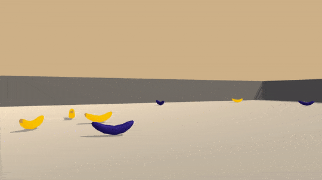

# Navigation - Banana RL - Udacity

This project is a submission for the Navigation project with the Udacity Deep Reinforcement Learning Nanodegree.



In this project we use Deep Q-Learning(DQN) to train an agent to collect bananas within a simple 3d world. The project uses Unity's ML-Agents environment. The goal of the agent is to collect yellow bananas while avoiding blue bananas.

The environment has a state space of 37 dimensions including basic information about the agent and the "ray-based" perception of the objects it can see. Note - For this project, no trainning was undertaken based on pixel values. 

The agent receives a reward of +1 for picking up a yellow banana and a -1 penalty/reward for picking up a blue banana. The environment is concsiderd solved when the agent receives an average score of +13 over 100 consecutive episodes. 

The agent has four discrete actions to choose from:
* 0 - Forward
* 1 - Backward
* 2 - Left
* 3 - Right

### Installation

The Unity ML-Agents environment only supports Python 3.6. 

Installation instructions for the Unity ML-Agents can be found at [Unity ML-Agents](https://github.com/Unity-Technologies/ml-agents/blob/master/docs/Installation.md) and [NumPy](http://www.numpy.org/). Note - You do not require the Unity download for this project.

The following prerequist libraries can be installed as follows:

pip install numpy

pip install torch

pip install unityagents

pip install matplotlib


### Run
In the terminal window, navigate to the basw directory of the proejct and run the following command:

```shell
$ jupyter notebook
```

This will open the Jupyter Notebook software and notebook in your browser which you can use to explore and reproduce the experiments that have been run. 