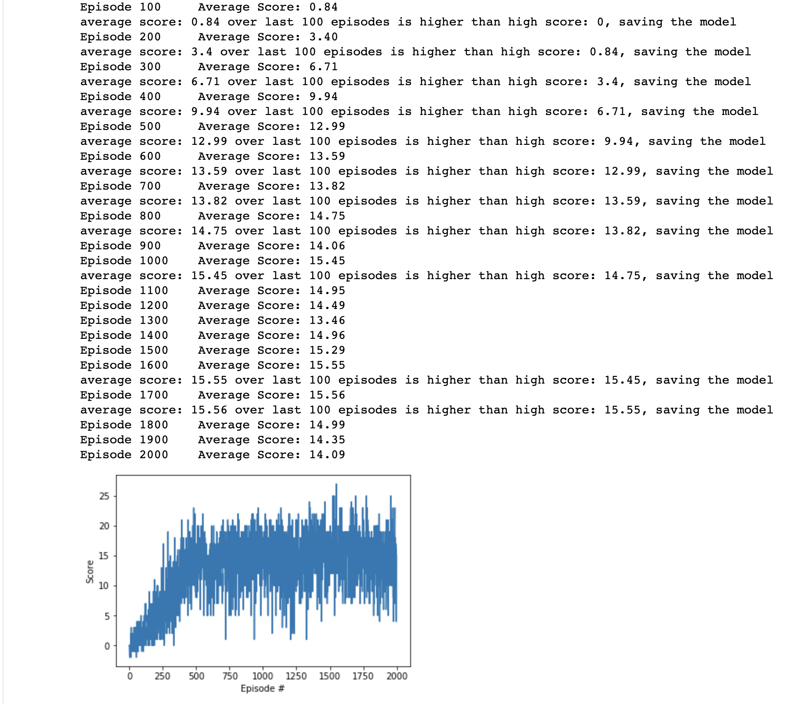

# Udacity Deep Reinforcement Learning - Navigation Project.

### Environment

In this project I use Deep Q-Learning(DQN) to train an agent to collect bananas within a large 3d world. The project environment is provided by Udacity and is similar but not exactly the same as [Banana Collector](https://github.com/Unity-Technologies/ml-agents/blob/master/docs/Learning-Environment-Examples.md#banana-collector) environment on the Unity ML-Agents GitHub page. 

A reward of +1 is provided for collecting a yellow banana, and a reward of -1 is provided for collecting a blue banana. The goal of the agent is to collect as many yellow bananas as possible while avoiding blue bananas.

The environment has a state space of 37 dimensions including basic information about the agent and the "ray-based" perception of the objects it can see.

The task is episodic, and the environment is considered solved when the agent receives an average score of +13 over 100 consecutive episodes. 

### Agent

To solved this project I used a Deep Q-Network, which is a combination of a [Q-Learning](https://en.wikipedia.org/wiki/Q-learning) algorithm (SARSA) with a [deep neural network](https://en.wikipedia.org/wiki/Neural_network) used instead of a Q-table.

The code used in this project is a slightly modified version of the [Lunar Lander](https://github.com/udacity/deep-reinforcement-learning/tree/master/dqn) tutorial provided by the Udacity oin their Deep RL nano degree, and consists out of the following:

* Navigation.ipynb: entry point for the project, contains the main training loop
* model.py: contains the neural network which is used to select actions based on the current state
* dqn_agent.py: contains the Agent implementation and ReplayBuffer to store the last 100 experiences for learning.

### Model Architecture

I used a simple feed forward neural network with 1 hidden layer and RELU activation function after after the input and the hidden layers.

The [MSE](https://en.wikipedia.org/wiki/Mean_squared_error) was used as the loss function with [ADAM](https://arxiv.org/pdf/1412.6980.pdf) used as the optimizer.

Model Layers are as following:
```
input layer:  in 37  out 64
hidden layer: in 64  out 128
output layer: in 128 out 4 

```

Agent hyper-parameters:

```
BUFFER_SIZE = int(1e5)  # replay buffer size
BATCH_SIZE = 64         # minibatch size
GAMMA = 0.99            # discount factor
TAU = 1e-3              # for soft update of target parameters
LR = 5e-4               # learning rate 
UPDATE_EVERY = 4        # how often to update the network
```

### Results

The most basic DQN was used for this task and it ended up doing pretty well, so I think any additional modifications would be an overkill for this exercise.

I trained the agent for 2000 episodes in total while checking the average score every 100 episodes and saving the model parameters if the score had increased over the previous iteration.

I tired different values for the number of steps per episode. The values from 100 to 500 were used during training. In the final run I limited the episode to 300 steps which yielded the best results.

The task was officially solved after 600 episodes with the score of 13.59 and the maximum score was achieved 1700 episodes with 15.56 . 




### Future work

Learning from Pixels

In the project, your agent learned from information such as its velocity, along with ray-based perception of objects around its forward direction. A more challenging task would be to learn directly from pixels!

This environment is almost identical to the project environment, where the only difference is that the state is an 84 x 84 RGB image, corresponding to the agent's first-person view of the environment.
 